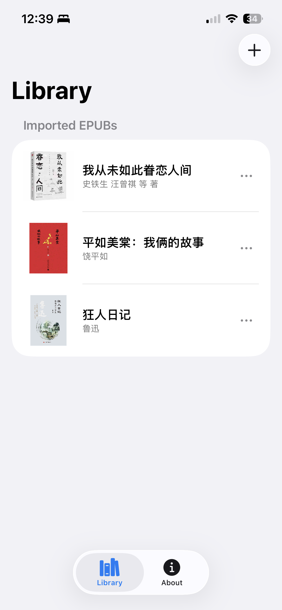
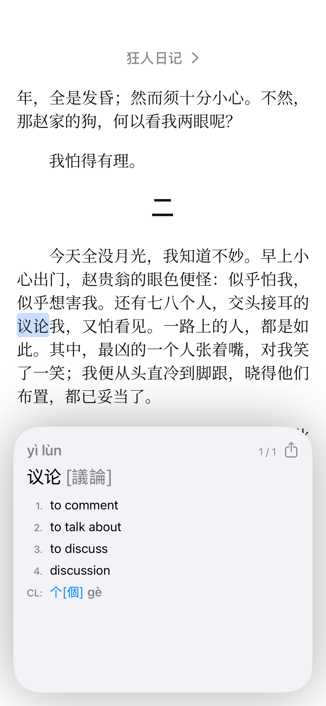

# 文 — Wen Reader  

## A fast, privacy-friendly Chinese EPUB reader with instant dictionary pop-ups.

Built out of a genuine love for learning Chinese, Wen Reader gives intermediate readers a clean, modern way to read native-level books while getting quick CEDICT definitions with a simple long-press. 

Import your own EPUBs, read with great typography, and stay fully offline.

---

  
  

## Features

### EPUB Import & Reading
- Import standard EPUBs from Files.
- Smooth pagination provided by the Readium Swift Toolkit.  
- Adjustable reading preferences (margins, font, line spacing, etc.).

### Long-Press Dictionary Popover
- Long-press on any Chinese text to show an inline dictionary panel.  
- Uses CC-CEDICT for offline definitions.  
- Automatic multi-character segmentation to surface the most likely word or idiom.  
- Options to copy the word, sentence, or paragraph; or send text to Pleco / ChatGPT (if installed).

### Navigation
- Tap the book title to view and navigate the table of contents.  
- Automatic position saving when you close the book.

### Privacy by Design
- No analytics of any kind.  
- No network access required for reading or dictionary use.  
- No accounts, cloud syncing, or data storage outside your device.  
- All processing — segmentation, lookups, interaction handling — is performed locally.

---

## Intended Audience

Wen Reader is built for **intermediate Chinese learners**:

- Readers who can understand native Chinese text with some effort.  
- Learners who want a modern, clean EPUB reading experience without distractions.  
- Users who benefit from quick dictionary support but do not need the full ecosystem of flashcards, handwriting input, OCR, etc.

Wen Reader is **not** a replacement for Pleco. Pleco remains the most complete Chinese dictionary and learning tool available; Wen Reader is designed to complement it by focusing exclusively on reading EPUB books with an unobtrusive inline lookup workflow.

If you read Chinese novels, essays, or non-fiction and want a lightweight, privacy-respecting tool to assist your reading, Wen Reader aims to fill that niche.

---

## Technical Overview

Wen Reader is implemented in Swift and SwiftUI.

### Rendering Engine
- Uses **Readium Mobile / Readium Swift** for EPUB parsing and pagination.
- A small JavaScript bridge is injected into the Readium WebView to:
  - extract the block, sentence, and character run at the press location
  - apply or remove highlighting around words

### Dictionary & Segmentation
- Segmentation is performed entirely on the Swift side using:
  - a CC-CEDICT-derived SQLite database for fast dictionary lookups  
  - a dynamic-programming segmentation algorithm that scores candidate tokenizations
  - longest-match preference with fallback handling for single-character or mixed Chinese/Latin runs  
- The JavaScript layer does not segment text; it only returns the raw text spans around the long-press location. All segmentation logic and dictionary lookup occur natively in Swift.

### Offline Architecture
Because all dictionary data and segmentation logic are stored locally, no external requests are made during reading. The app remains functional in airplane mode and does not transmit user data.

---

## Third-Party Acknowledgements

Wen Reader would not be possible without the following open-source or freely licensed projects:

- **CC-CEDICT**  
  https://cc-cedict.org/wiki/  
  © MDBG. Distributed under a permissive license.

- **Readium Mobile / Readium Swift**  
  https://github.com/readium  
  © EDRLab. Licensed under BSD-3-Clause.

- **Noto Serif SC** (Google Fonts)  
  https://fonts.google.com/noto/specimen/Noto+Serif+SC  
  Licensed under the Open Font License (OFL).

- **Pleco** (optional external integration)  
  https://www.pleco.com/  
  Not bundled with the app; Wen Reader simply provides an option to send text to Pleco if installed.

---

## Privacy

Wen Reader collects **no data**.  
Specifically:

- no analytics  
- no telemetry  
- no crash reporting  
- no external servers  
- no logging of reading behavior or dictionary usage  

All data — including imported books — stays on your device.

For App Store purposes, Wen Reader falls under **“Data Not Collected.”**

---

## Open Source & Community

Wen Reader is free and open source as a small contribution back to the Chinese-learning community. I’m a heritage speaker who only began seriously learning Chinese in 2023, and reading native books played a huge role in helping me reconnect with the language. As a software developer, building this app felt like the most natural way to give something back — especially since this is the exact tool I always wished I had.

If you find Wen Reader useful, have ideas, or want to help shape its future, I’d love to hear from you.
Issues, feedback, and pull requests are very welcome.

You can reach me at oliverzh2000@gmail.com

(or just open a GitHub issue — that’s even better).

---

## Screenshots & Demos

*(To be added: images and short video demonstrations of the reading UI, long-press dictionary popover, ToC, and EPUB import workflow.)*

---

## Roadmap (Non-binding)

Planned improvements for future releases include:

- Context-aware word segmentation  
Transitioning from heuristic / dictionary-driven segmentation to a transformer-based on-device model.
This enables more accurate boundaries for idioms, rare words, and ambiguous cases that rule-based methods struggle with.

- Optional on-device LLM for richer glosses  
Users could toggle an offline model to generate concise sense-appropriate definitions or usage notes.

- Improved highlighting system  
Fixing the known issue where dark mode highlights are overridden by Readium’s CSS.
Longer-term: a more robust overlay-based highlight engine.

- Bookmarks & in-book search  
Standard reading features that are on the way.

- Flashcard export  
Export looked-up words or highlighted words into a structured format for other tools (Anki, Pleco, etc).

