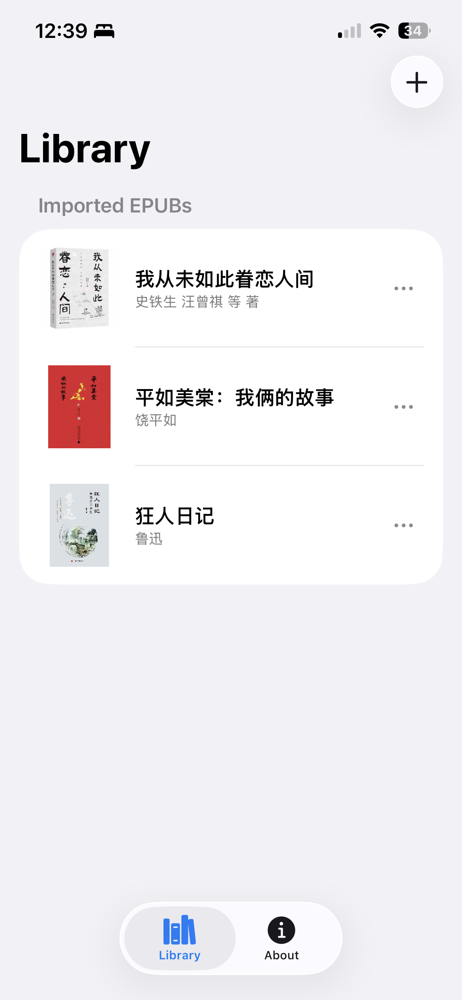
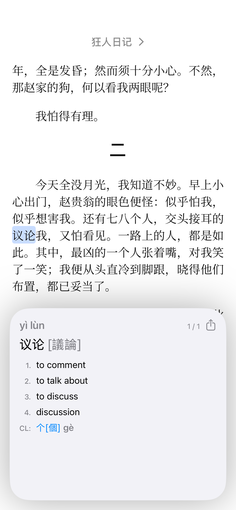

# 文 — Wen Reader  

## A fast, privacy-friendly Chinese EPUB reader with instant dictionary pop-ups.

Built out of a genuine love for learning Chinese, Wen Reader gives intermediate readers a clean, modern way to read native-level books while getting context-aware dictionary definitions with a simple long-press. 

Import your own EPUBs, read with great typography, and stay fully offline.

---

  
    &nbsp;
  

## Features

### EPUB Import & Reading
- Import standard EPUBs from Files.
- Smooth pagination provided by the Readium Swift Toolkit.  
- Adjustable reading preferences (margins, font, line spacing, etc.).

### Long-Press Dictionary Popover
- Long-press on any Chinese text to show an inline dictionary panel.  
- Uses CC-CEDICT for offline definitions.  
- Context-aware word boundary segmentation and dictionary definition ranking powered by lightweight on-device ML (see [Technical Overview](#on-device-ml)).
- Options to copy the word, sentence, or paragraph; or send text to Pleco (if installed)

### Navigation
- Tap the book title to view and navigate the table of contents.  
- Automatic position saving when you close the book.

### Privacy by Design
- No analytics of any kind.  
- No network access required for reading or dictionary use.  
- No accounts, cloud syncing, or data storage outside your device.  
- All processing — segmentation, lookups, interaction handling — is performed locally.

---

## Technical Overview

Wen Reader is implemented in Swift and SwiftUI.

### Rendering Engine
- Uses **Readium Mobile / Readium Swift** for EPUB parsing and pagination.
- A small JavaScript bridge is injected into the Readium WebView to:
  - extract the block, sentence, and character run at the press location
  - apply or remove highlighting around words

### On-Device ML

Wen Reader runs two small BERT-style neural networks entirely on-device via CoreML to provide context-aware Chinese word segmentation and word sense disambiguation — no internet required.

- **Word boundary segmentation:** A model evaluates all possible dictionary word spans in a sentence and finds the best overall segmentation.
  - Example: in 研究生命的意义 the model correctly segments 研究|生命|的|意义 "to study the meaning of life" rather than 研究生|命|的|意义 "graduate student|fate|…".

- **Dictionary definition ranking:** A model ranks dictionary definitions by how well they match the surrounding context, so the popup shows the right meaning first.
  - Example: 长 has multiple pronunciations and meanings — in 孩子长大了 the model surfaces "zhǎng: to grow" rather than "cháng: long" or "zhǎng: chief".

Both models are fine-tuned on a mix of open corpora (Wikipedia, OpenSubtitles, ICWB2, ebooks), LLM-annotated sentences from those corpora, and LLM-generated training examples. Models are quantized to int8 weights and run in 5–40ms on an iPhone 13 Pro. Total model footprint is ~44 MB. 

For technical details on architecture, training data, and evaluation, see [#2](https://github.com/oliverzh2000/wen-reader/issues/2).

### Dictionary & Lookup
- Uses a CC-CEDICT-derived SQLite database for offline definitions and sense embeddings.
- All segmentation, scoring, and dictionary lookup occur natively in Swift — the JavaScript layer only extracts raw text spans around the long-press location.

---

## Third-Party Acknowledgements

Wen Reader would not be possible without the following open-source or freely licensed projects:

- **CC-CEDICT**  
  https://cc-cedict.org/wiki/  
  © MDBG. Distributed under a permissive license.

- **Readium Mobile / Readium Swift**  
  https://github.com/readium  
  © EDRLab. Licensed under BSD-3-Clause.

- **Chinese ELECTRA** (HFL, Harbin Institute of Technology & iFLYTEK)  
  https://huggingface.co/hfl/chinese-electra-180g-small-discriminator  
  Base encoder for the word segmentation model. Licensed under Apache 2.0.

- **GTE (General Text Embeddings)** (Alibaba DAMO Academy)  
  https://huggingface.co/thenlper/gte-base-zh  
  Base encoder for the word sense disambiguation model (distilled from gte-base-zh to gte-small-zh). Licensed under MIT.

- **MiCLS** (ACL 2024, Peking University)  
  https://huggingface.co/datasets/wyy209/MiCLS  
  Chinese WSD corpus used as training data. Licensed under MIT.

- **ICWB2** (SIGHAN Bakeoff 2005)  
  https://github.com/yuikns/icwb2-data  
  MSR segmentation corpus used as training data.

- **Chinese Wikipedia**  
  https://huggingface.co/datasets/wikimedia/wikipedia (20231101.zh)  
  Source corpus for segmentation training data. Licensed under CC-BY-SA 3.0.

- **OpenSubtitles zh-cn**  
  https://huggingface.co/datasets/FradSer/OpenSubtitles-en-zh-cn-20m  
  Source corpus for segmentation training data.

- **Noto Serif SC** (Google Fonts)  
  https://fonts.google.com/noto/specimen/Noto+Serif+SC  
  Licensed under the Open Font License (OFL).

- **Pleco** (optional external integration)  
  https://www.pleco.com/  
  Not bundled with the app; Wen Reader provides an option to send text to Pleco if installed.

---

## Privacy

Wen Reader collects **no data**.  
Specifically:

- no analytics  
- no telemetry  
- no crash reporting  
- no external servers (no cloud APIs, no LLM calls — all ML runs on-device)  
- no logging of reading behavior or dictionary usage beyond your device  

All data — including imported books — stays on your device.

For App Store purposes, Wen Reader falls under **“Data Not Collected.”**

---

## Open Source & Community

Wen Reader is free and open source as a small contribution back to the Chinese-learning community. I’m a heritage speaker who only began seriously learning Chinese in 2023, and reading native books played a huge role in helping me reconnect with the language. As a software developer, building this app felt like the most natural way to give something back — especially since this is the exact tool I always wished I had.

If you find Wen Reader useful, have ideas, or want to help shape its future, I’d love to hear from you.
Issues, feedback, and pull requests are very welcome.

You can reach me at oliverzh2000@gmail.com

(or just open a GitHub issue — that’s even better).

---

## Roadmap

Planned improvements for future releases include:

- Bookmarks & in-book search  
- Flashcard (Pleco, Anki, etc) export
